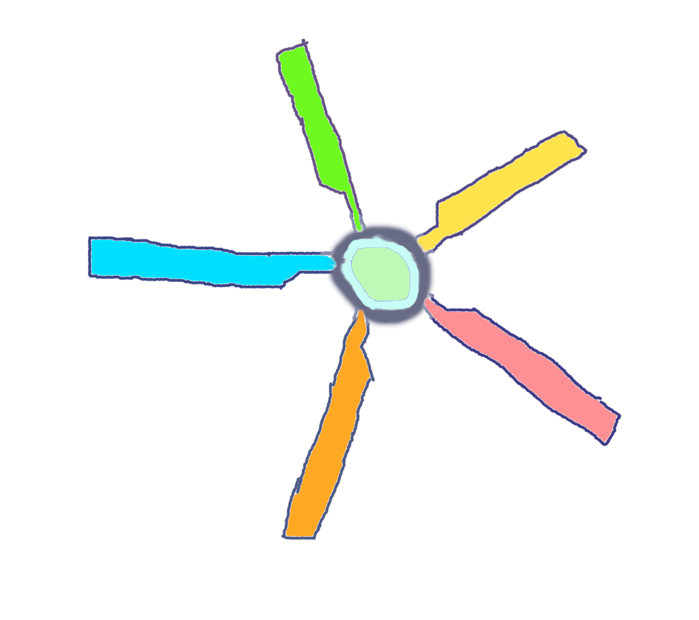

Rotor
======

###A JavaScript tool for HTML element switching###

rotor.js includes the function <code>flipPic()</code>, which will swap out element2 and put element1 in its place when used this way:

`flipPic(element1, element2);`

The first two parameters can be any valid CSS selector.  For example if you wanted to remove the image with id <code>firstImg</code> and put the image with id <code>secondImg</code> there, you would call flipPic like this:

`flipPic('img#secondImg', 'img#firstImg');`

The flipPic function can be called with no parameters and it will default to trying to remove the first child of the element with id <code>rotor</code> and swap in the next child.  More can be learned by looking at the [code](js/rotor.js).

The [index.html](index.html) in this project implements Rotor and its default element swapping behavior can be seen when clicking the button.

Rotor requires [jQuery](http://jquery.com), and by default uses that library's fadeIn() and fadeOut() methods, but that behavior can be overridden by passing in different comparable methods like toggle() in flipPic's 5th and 6th parameters.  (The 3rd and 4th parameters allow the default parent and child selectors to be overridden; if you want to skip any parameters in the flipPic function then just pass them 'null').

Rotor was created by [Dan McKeown](http://danmckeown.info) and [an ES5-transpiled version of it](js/rotor010beta4babelIIFE.js) was used in the [Northpaw](http://djmblog.com/product/18) theme for WordPress.
